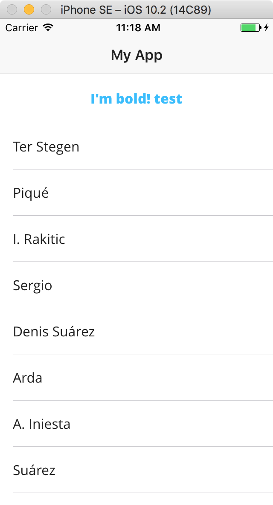
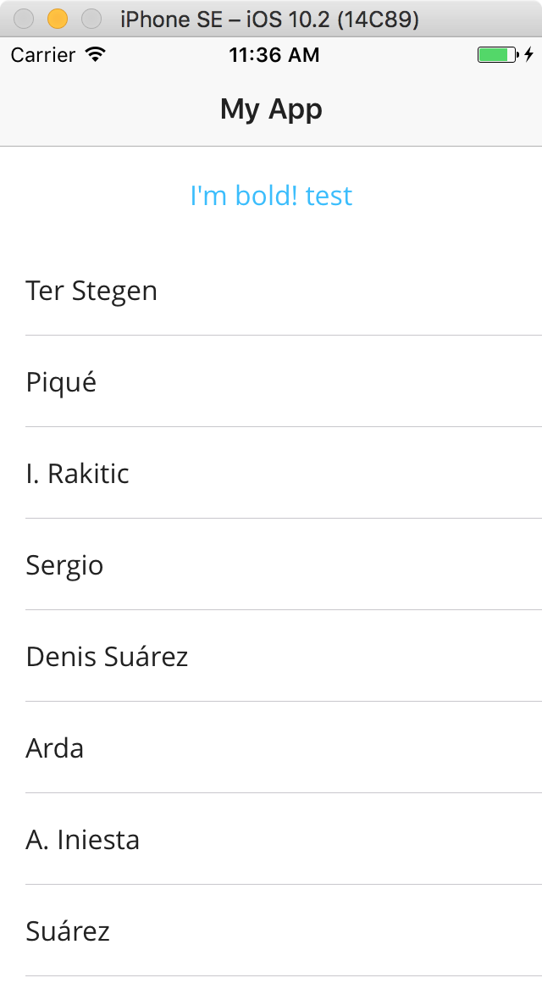

# Example app to show NS 2.5.3 font issues

https://github.com/NativeScript/NativeScript/issues/4497

When using a custom font like `OpenSans-Bold` in NS 2.5.2 the text is shown bold. When upgrading to 2.5.3 the text is not bold any more.

## 2.5.2

## 2.5.3

